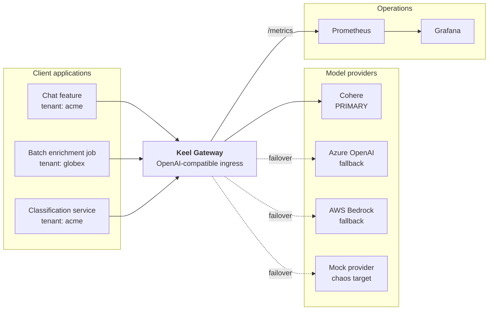

# Keel

A self-healing, multi-provider LLM gateway with Cohere as the primary provider and Azure OpenAI / AWS Bedrock as capability-aware fallback targets.

---

> [PLACEHOLDER: 90-second demo video/GIF — record in Phase 6. Shows healthy traffic → degradation → breaker trip → reroute → recovery (FR-7.4). Goes here, above everything else.]

---

## What this is

Keel is a single service that every model call in a fleet passes through. Applications point at it instead of at a provider SDK, and it decides which provider actually answers each request.

When a provider starts failing or slowing down, Keel notices, stops sending it traffic, sends that traffic somewhere else, and starts using the provider again once it recovers — without anyone being paged. Every request that passes through carries a tenant, a feature, and a request class, so the cost of all of it can be attributed.

## Why it exists

The obvious way to build failover is a preference list: try Cohere, and if Cohere is down, try the next provider. That is also how you introduce a correctness bug.

Providers are not interchangeable. A request that needs structured citations, a specific tool-use format, or a safety mode has semantics the fallback may not support. Naive failover still returns `200 OK` — the request just comes back without citations, and a downstream consumer has no way to tell. The outage is survived and the answers are quietly wrong. That is **silent semantic downgrade**: a correctness bug wearing a resilience costume.

Keel answers this by running the capability filter **before** preference ordering. A request tagged `citations` never sees a provider that lacks citation support, no matter how healthy that provider is or how high it sits in the preference list. If no capable provider is available, the request queues (when deferrable) or fails explicitly with `422` — it is never silently downgraded. Degrade loudly, never silently.

The full argument is in [Technical Design §5.7](docs/TECHNICAL-DESIGN.md).

## Architecture



Clients migrate by changing a base URL and an API key. The gateway is the only component that knows a provider SDK exists.

Container architecture, request lifecycle, and component design are in [docs/TECHNICAL-DESIGN.md](docs/TECHNICAL-DESIGN.md).

## Quickstart

```bash
docker compose up
```

[PLACEHOLDER: exact commands once the compose file exists — clone URL, `.env` setup from `.env.example`, ports, the Grafana URL and default login, and the curl that sends a first request through the gateway. Fill in during Phase 2 when the compose stack lands; verify against the Phase 6 exit criteria.]

[PLACEHOLDER: the chaos commands that let a reviewer break a provider themselves (FR-7.2) — fill in during Phase 6.]

**Time to healthy dashboard:** the target is **≤ 5 minutes** on a clean machine (PRD success criterion S8). This is a design target, not a measured result.

## Measured results

[PLACEHOLDER: measured results table — PRD §4 criteria S1–S8, filled in after the Phase 6 measurement run. Report what was actually measured, including unimpressive numbers, with an explanation. No estimates, no targets restated as results.]

| ID | Criterion | Target | Measured |
|---|---|---|---|
| S1 | Availability sustained through a simulated primary-provider outage | ≥ 99% of interactive requests return a valid response | [PLACEHOLDER] |
| S2 | Time from provider degradation onset to traffic fully rerouted | p95 ≤ 2× the health-window length | [PLACEHOLDER] |
| S3 | Automatic recovery after the provider returns, with no operator action | Breaker closes within 3 successful half-open probe cycles | [PLACEHOLDER] |
| S4 | Cost attribution completeness | 100% of served requests carry tenant, feature, and request class; cost computed per request | [PLACEHOLDER] |
| S5 | Gateway latency overhead, excluding provider time | p95 ≤ 15 ms added | [PLACEHOLDER] |
| S6 | Deferrable work survives total provider unavailability | 0 lost jobs, 0 duplicated side effects across a full outage-and-replay cycle | [PLACEHOLDER] |
| S7 | Capability-safe failover | 0 instances of a capability-tagged request being served by a provider that cannot satisfy the tag | [PLACEHOLDER] |
| S8 | Cold start for a reviewer | `docker compose up` to healthy dashboard in ≤ 5 minutes on a clean machine | [PLACEHOLDER] |

## Key design decisions

Short form. The reasoning and the rejected alternatives are in [Technical Design §9](docs/TECHNICAL-DESIGN.md).

- **D1 — The mock provider is a permanent component, not scaffolding.** Real providers will not fail on cue during a demo, and the test suite is forbidden from making live API calls (NFR-2).
- **D2 — The capability filter runs before preference ordering.** Filtering after the health check permits silent semantic downgrade. This is the central design constraint of the system.
- **D3 — Health windows are bucketed, not a sorted-set event log.** Bounded memory and O(1) writes; the resulting 5 s of edge staleness sits inside the S2 budget.
- **D4 — The adapter layer sits above the routing library rather than being replaced by it.** Isolates library version churn, houses error normalization, and lets the mock adapter be first-class.
- **D5 — Request metadata travels in headers, not body extension fields.** Survives payload pass-through to providers, and is inspectable without parsing JSON.
- **D6 — The deferred worker is a separate process.** Queued work exists to survive bad conditions, and a gateway crash during an outage is a plausible bad condition.
- **D7 — Auth failures and content filters do not count toward the breaker.** Otherwise one bad API key opens every breaker and the gateway declares a total outage over a typo.
- **D8 — Streaming is deferred to v1.1.** It complicates every layer, and mid-stream failover semantics need their own design.
- **D9 — Cost is computed after the response is returned.** Protects the 15 ms latency budget.

## Known limitations

From [Technical Design §10](docs/TECHNICAL-DESIGN.md).

- **Single gateway instance.** No HA for the gateway itself. Breaker state is in Redis so a multi-instance deployment is *possible*, but it is untested and Redis is a single point of failure in this topology.
- **Approximate p95 in breaker decisions.** Reservoir sampling under high load; authoritative numbers come from Prometheus histograms.
- **No streaming.** Mid-stream failover is undefined in v1.
- **No real authn.** Static API keys only; tenant identity is asserted by the caller and not verified. Acceptable for a demonstrator, disqualifying for production.
- **Cross-provider response equivalence is capability-level, not quality-level.** Capability tags guarantee a fallback *can* do the thing; they say nothing about doing it as well.
- **Pricing table drifts.** Rates are manually maintained and dated. Stale entries corrupt cost claims silently.

## Repo layout

```
keel/
├── README.md              # demo video first, then architecture summary
├── docs/                  # PRD, technical design, ADRs
├── keel/
│   ├── api/               # ingress, envelope validation, chaos endpoints
│   ├── routing/           # router, preference resolution, capability filter
│   ├── providers/         # adapters + normalization
│   ├── health/            # window tracker, breaker
│   ├── queue/             # deferred worker, idempotency
│   ├── cost/              # pricing table, attribution
│   └── observability/     # metrics, structured logging
├── config/keel.yaml
├── deploy/                # compose, prometheus, grafana provisioning
└── tests/
```

## Documentation

| Document | Contents |
|---|---|
| [docs/PRD.md](docs/PRD.md) | What is being built and why — goals, users, requirements, success criteria, risks |
| [docs/TECHNICAL-DESIGN.md](docs/TECHNICAL-DESIGN.md) | How it is built — components, data models, interfaces, decisions, limitations |
| [docs/adr/](docs/adr/) | Architecture decision records |

Where the PRD and the technical design conflict, the PRD wins.

## Status

[PLACEHOLDER: current build phase and what works today — update as phases complete.]

## License

[PLACEHOLDER: no license is specified in the source documents — choose one and add a LICENSE file before the repo goes public in Phase 6.]
