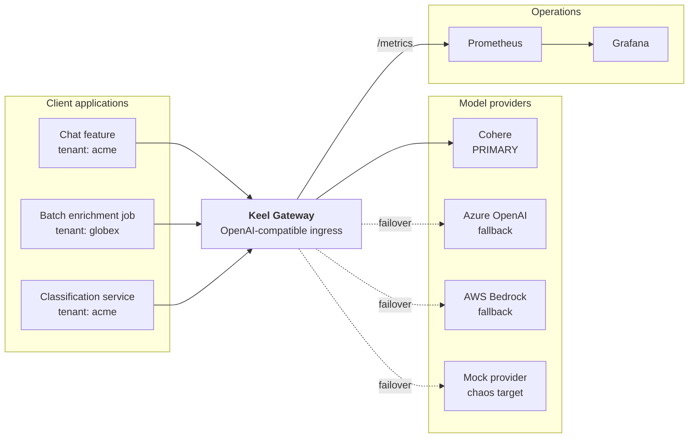
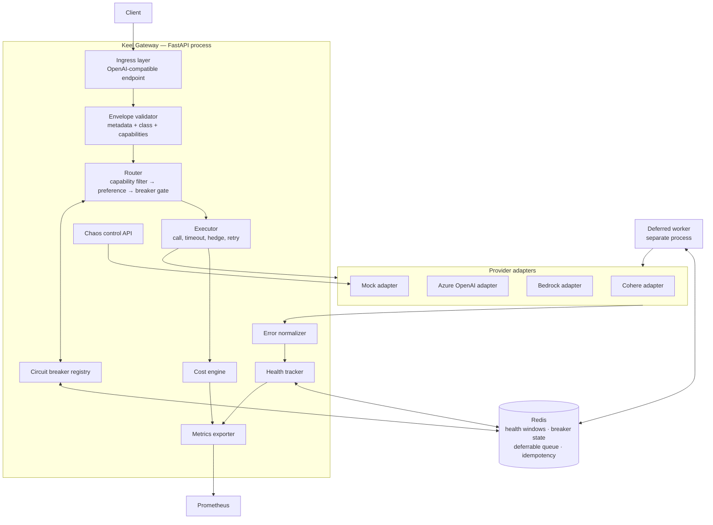
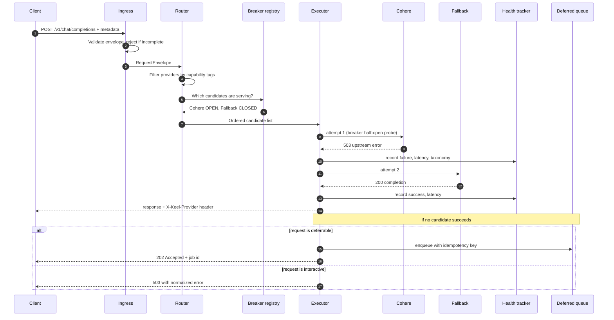
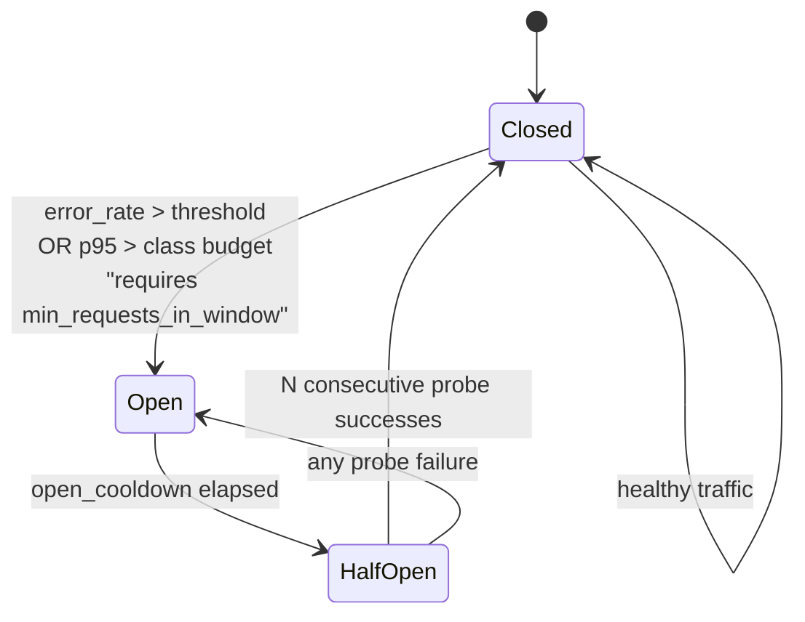
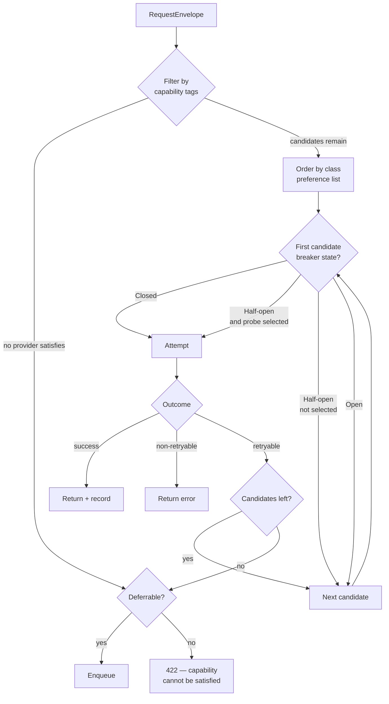
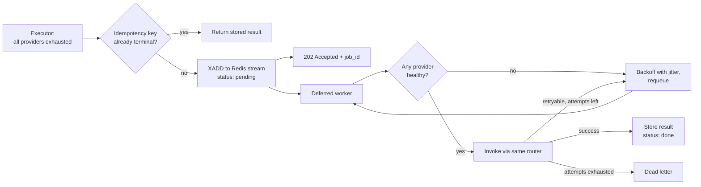
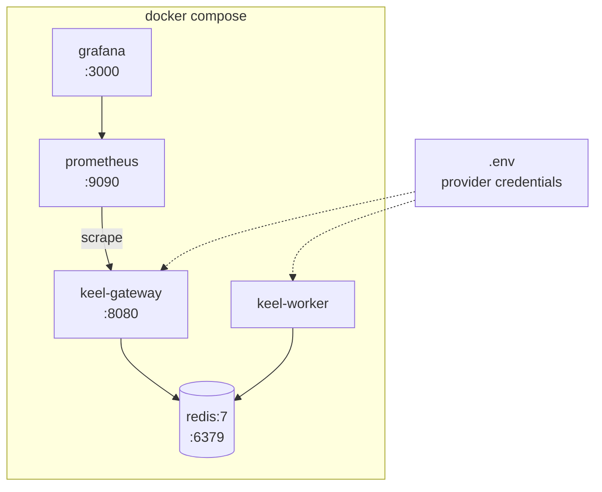

# Technical Design — Self-Healing LLM Gateway (Keel)

**Owner:** Jamil
**Status:** Draft v1.0
**Last updated:** 2026-08-17
**Related documents:** `PRD.md`

This document defines *how* Keel is built. Requirement IDs referenced throughout (FR-x.x, NFR-x, S-x) are defined in the PRD. Where this document and the PRD conflict, the PRD wins.

---

## 1. Design principles

These five principles decide arguments later in the build. They are listed first so that any implementation choice can be checked against them.

1. **Policy is configuration, not code.** Providers, preference orders, thresholds, capabilities, and budgets live in a validated config file. Adding a provider must not require touching the router.
2. **Observe before you react.** Health tracking is complete and visible before any failover logic exists. A breaker whose inputs you cannot see is guesswork (FR-3.4).
3. **Determinism in tests, chaos in demos.** Every time-dependent behaviour is driven by an injectable clock, and every failure mode is reproducible against mock providers. No live API calls in the test suite (NFR-2).
4. **Degrade loudly, never silently.** A request that cannot be served with its declared semantics fails or queues. It is never quietly answered by a provider that cannot satisfy it (FR-4.6).
5. **The gateway is on the hot path.** Any work that is not required to produce the response is done asynchronously or after the response is returned. Latency budget is 15 ms p95 (NFR-5 / S5).

---

## 2. System context



Clients migrate by changing a base URL and an API key. The gateway is the only component that knows a provider SDK exists.

---

## 3. Container architecture



**Why the deferred worker is a separate process.** In-process background tasks die with the process. Deferrable work exists precisely to survive bad conditions, and a gateway crash during an outage is a plausible bad condition. A separate consumer also lets the gateway be restarted for config changes without dropping queued jobs. This resolves PRD open question Q4.

---

## 4. Request lifecycle



The `X-Keel-Provider`, `X-Keel-Attempts`, and `X-Keel-Cost-Micros` response headers exist so the demo can show routing decisions without opening a dashboard.

---

## 5. Core components

### 5.1 Ingress and the request envelope

The public surface is an OpenAI-compatible `POST /v1/chat/completions`. Compatibility is what makes adoption a base-URL change (FR-1.1), but Keel needs metadata the OpenAI schema does not carry.

**Approach:** metadata travels in headers, with an `x_keel` object in the request body as fallback for clients that cannot set headers. The header wins when both supply a field, and `x_keel` is stripped from the payload before it reaches a provider — a header survives request-body pass-through untouched, a body field would not.

```
X-Keel-Tenant: acme            (required)
X-Keel-Feature: support-summary (required)
X-Keel-Request-Id: uuid         (required, echoed in all logs and metrics)
X-Keel-Class: interactive_chat  (required)
X-Keel-Capabilities: citations,tool_use   (optional, comma separated)
X-Keel-Idempotency-Key: ...     (required for deferrable classes)
```

Headers are preferred over body fields because they survive request-body pass-through to providers untouched, and because a proxy can inspect them without parsing JSON. Missing required metadata returns `400` with a machine-readable error listing *all* the absent fields, not the first (FR-1.3; body shape in ADR 0003) — this is deliberate strictness, since a gateway that accepts untagged traffic cannot honour S4.

Internally every request becomes a `RequestEnvelope`:

| Field | Type | Notes |
|---|---|---|
| `request_id` | str | Correlation key across attempts, logs, metrics |
| `tenant` | str | Cost and metric dimension |
| `feature` | str | Cost and metric dimension |
| `request_class` | str | Validated against `config.request_classes`, not an enum — classes are config-defined (principle 1). Drives preference list, timeout, breaker budget |
| `capabilities` | frozenset[str] | Hard routing constraint. Matches `ProviderConfig.capabilities` |
| `deferrable` | bool | Derived from class config |
| `idempotency_key` | str \| None | Required when deferrable |
| `payload` | dict | The provider-bound request body |
| `received_at` | float | From injected clock, not `time.time()` directly |

### 5.2 Configuration model

One validated YAML file is the source of truth for routing behaviour (FR-2.3). Validated at startup with a schema; invalid config fails the process rather than surfacing at first request (NFR-4).

```yaml
providers:
  cohere_primary:
    adapter: cohere
    model: command-a
    capabilities: [citations, tool_use, structured_output]
    pricing: { input_per_mtok: 2.50, output_per_mtok: 10.00 }
    timeout_ms: 30000
  azure_fallback:
    adapter: azure_openai
    deployment: gpt-4o
    capabilities: [tool_use, structured_output]
    pricing: { input_per_mtok: 2.50, output_per_mtok: 10.00 }
    timeout_ms: 30000
  bedrock_fallback:
    adapter: bedrock
    model: anthropic.claude-sonnet-4
    capabilities: [tool_use, structured_output]
    pricing: { input_per_mtok: 3.00, output_per_mtok: 15.00 }
    timeout_ms: 30000
  mock_chaos:
    adapter: mock
    capabilities: [citations, tool_use, structured_output]
    pricing: { input_per_mtok: 0.0, output_per_mtok: 0.0 }

request_classes:
  interactive_chat:
    deferrable: false
    preference: [cohere_primary, azure_fallback, bedrock_fallback]
    latency_budget_p95_ms: 4000
    hedge: { enabled: false, after_ms: 1500 }
  classification:
    deferrable: false
    preference: [cohere_primary, azure_fallback]
    latency_budget_p95_ms: 800
    hedge: { enabled: true, after_ms: 400 }
  batch_enrichment:
    deferrable: true
    preference: [cohere_primary, bedrock_fallback]
    latency_budget_p95_ms: 60000

breaker:
  window_seconds: 60
  bucket_seconds: 5
  min_requests_in_window: 20
  error_rate_threshold: 0.30
  open_cooldown_seconds: 30
  half_open_probe_ratio: 0.10
  half_open_successes_to_close: 3
```

**Note the pricing values are illustrative.** Real per-model rates are populated at implementation time and version-controlled with a dated source comment, because stale pricing silently corrupts every cost claim the project makes.

**The block above is the end state, not what ships today.** `azure_fallback` and `bedrock_fallback` are commented out in `config/keel.yaml` and absent from every preference list until Phase 4 brings their adapters and credentials (FR-2.6). The registry refuses to build a provider it cannot serve rather than skipping it, since a silently shortened preference list is a failover target the operator believes in and the gateway does not have — **ADR 0004**, which also records why `mock_chaos` carries the `citations` asymmetry in the meantime.

### 5.3 Provider adapters

Each adapter implements one interface:

```python
class ProviderAdapter(Protocol):
    name: str
    async def invoke(self, envelope: RequestEnvelope) -> ProviderResult: ...
    def capabilities(self) -> frozenset[str]: ...
```

`ProviderResult` carries the normalized response, token counts, wall-clock latency, and either success or a `NormalizedError` — never both and never neither, enforced on the model. A provider failure is a **return value, not an exception**: failure is the case the gateway exists to handle, so it travels the same path as success rather than unwinding past the executor that has to record it. Absent token counts are `None` rather than `0`, or a provider that omits usage data becomes the cheapest one in the Phase 4 cost report.

A routing library (LiteLLM) handles request/response shape translation where it can. The adapter layer sits *above* it rather than being replaced by it, for three reasons: it isolates the codebase from library version churn, it is where per-provider error normalization lives, and it is the only way to give the mock adapter first-class status.

**The mock adapter is a permanent component, not scaffolding.** It provides a controllable failure source that a real provider cannot: real providers refuse to break on cue during a demo, and unit tests must not depend on a live API (NFR-2). Its scope is hard-capped at latency distribution, error rate, error class, and a chaos control endpoint. Nothing else.

### 5.4 Error normalization

Providers signal the same condition differently — an HTTP 429, a `ThrottlingException`, and a `RateLimitError` are one concept. The breaker must not treat them as three.

| Normalized class | Counts toward breaker? | Retry elsewhere? | Notes |
|---|---|---|---|
| `RATE_LIMIT` | Yes | Yes | Self-inflicted during load tests; a legitimate test case, not a bug (PRD C4) |
| `TIMEOUT` | Yes | Yes | Distinguished from server error because latency budgets treat it differently |
| `SERVER_ERROR` | Yes | Yes | 5xx from provider |
| `QUOTA_EXHAUSTED` | Yes | Yes | Trips the breaker fast; retrying the same provider is pointless |
| `AUTH_FAILURE` | No | No | Configuration fault, not provider health. Must not trip a breaker |
| `CONTENT_FILTER` | No | No | Provider behaved correctly. Retrying elsewhere is a policy decision, defaulted off |
| `BAD_REQUEST` | No | No | Client fault. Returned directly |

The two "No" rows matter more than they look. Counting auth failures as provider degradation means a bad API key opens every breaker and the gateway declares total outage over a typo. Counting content filters as failures means a policy-violating prompt gets retried across every provider until all breakers trip.

### 5.5 Health tracker

Per-provider rolling window, persisted in Redis so restarts do not reset the health view (FR-3.2).

**Key schema:**

```
keel:health:{provider}:{bucket_epoch}     HASH   ok, err_rate_limit, err_timeout, ...   TTL 2×window
keel:latency:{provider}:{bucket_epoch}    LIST   capped reservoir of latency samples     TTL 2×window
keel:breaker:{provider}                   HASH   state, opened_at, probe_successes
keel:queue:deferred                       STREAM  deferrable jobs
keel:idem:{key}                           STRING  status + response, TTL 24h
```

Buckets are fixed-width (5 s) and the window is the union of the last 12 buckets. This is a **sliding window of discrete buckets**, not a true continuous sliding window — a deliberate simplification. The alternative, a sorted set of individual events, gives exact windowing at the cost of O(n) memory per provider and a `ZREMRANGEBYSCORE` on every request. Bucket granularity introduces at most 5 s of staleness at the window edge, which is well inside the S2 target of "p95 reroute time ≤ 2× window length."

**Percentiles.** Redis cannot compute percentiles natively. Latency samples are kept as a capped reservoir per bucket (e.g. 200 samples) and percentiles are computed in-process across merged buckets. This is approximate under high load. That is acceptable because the p95 figure here drives a *threshold comparison*, not a reported SLA — the authoritative latency numbers for the README come from Prometheus histograms, which are exported separately and not subject to reservoir sampling.

### 5.6 Circuit breaker



Three details carry most of the value:

**`min_requests_in_window` prevents statistical nonsense.** Two failures out of three requests is a 67% error rate and means nothing. Without a volume floor, a low-traffic provider oscillates.

**Half-open is what makes it self-healing (FR-4.4).** In half-open, a configured fraction of eligible traffic is admitted to the recovering provider. A single probe failure reopens immediately rather than waiting out the window — recovery should be cautious and relapse should be instant. Without this state the breaker opens once and never closes, which is a kill switch, not resilience.

**State is shared through Redis, not process memory.** State transitions use an atomic compare-and-set so that concurrent requests cannot each independently decide to trip the same breaker.

### 5.7 Router



**Capability filtering happens before preference ordering, not after.** This is the ordering that enforces principle 4. A request tagged `citations` simply never sees a provider that lacks citation support, regardless of how healthy that provider is or how high it sits in the preference list. The failure mode being prevented: Cohere degrades, traffic falls over to a model with no structured-citation support, responses still return `200`, and a downstream consumer silently receives answers with no citations attached. That is a correctness bug wearing a resilience costume, and it is the single most interesting design constraint in this system.

`422` rather than `503` when no capable provider exists, because the condition is semantic rather than transient.

### 5.8 Hedged requests

For latency-sensitive classes only, disabled by default (FR-4.8). After `after_ms`, a second candidate is invoked concurrently; the first successful response wins and the loser is cancelled. Both attempts are recorded in health and cost metrics, since both consumed provider capacity.

Hedging roughly doubles spend on hedged calls. The dashboard surfaces hedge rate and hedge-attributable cost so the trade-off is visible rather than assumed.

### 5.9 Deferrable work and idempotency



**Idempotency keys are checked before enqueue and again before invocation**, using an atomic set-if-absent. The failure this prevents: a job is retried after a network partition, the original attempt actually succeeded at the provider, and the caller's side effect fires twice. Exponential backoff with jitter avoids a synchronized retry stampede the moment a provider recovers — without jitter, every queued job hits the newly healthy provider simultaneously and re-trips the breaker it was waiting on.

The worker consumes through a Redis stream with a consumer group, so an unacknowledged message is redelivered if the worker dies mid-job.

### 5.10 Cost engine

Cost is computed per attempt from the config pricing table, using token counts returned by the provider. Emitted as a Prometheus counter dimensioned by `tenant`, `feature`, `request_class`, `provider`, and `attempt_type` (primary / failover / hedge).

That last dimension is what makes FR-6.3 possible: the cost delta of failover is a query, not a separate subsystem. "Routing away from the primary costs 1.8× on this workload class" is a sharper claim than an availability percentage, and it is the kind of statement this project exists to be able to make.

Computation happens *after* the response is returned to the client, to protect the latency budget.

---

## 6. Metrics catalogue

| Metric | Type | Labels |
|---|---|---|
| `keel_requests_total` | counter | tenant, feature, class, provider, outcome |
| `keel_request_duration_seconds` | histogram | class, provider |
| `keel_gateway_overhead_seconds` | histogram | class |
| `keel_provider_errors_total` | counter | provider, error_class |
| `keel_breaker_state` | gauge | provider — 0 closed, 1 half-open, 2 open |
| `keel_breaker_transitions_total` | counter | provider, from_state, to_state |
| `keel_failover_events_total` | counter | from_provider, to_provider, class |
| `keel_hedge_attempts_total` | counter | class, winner |
| `keel_queue_depth` | gauge | — |
| `keel_queue_job_age_seconds` | histogram | — |
| `keel_cost_micros_total` | counter | tenant, feature, class, provider, attempt_type |

`keel_gateway_overhead_seconds` is separate from total duration specifically so S5 can be measured rather than asserted.

**Dashboard panels** (FR-7.1): RPS by provider · error rate by normalized class · p95 latency by provider · circuit state timeline · failover event annotations · queue depth · cost per hour by tenant and by feature.

The circuit state timeline is the panel the demo video is built around — it renders the trip, the flat open period, the half-open probes, and the close as one readable shape.

---

## 7. Testing strategy

| Layer | Approach |
|---|---|
| Breaker state machine | Pure unit tests against an injectable `Clock`. Time is advanced explicitly; no `sleep` in tests |
| Router | Table-driven tests over capability sets × breaker states × preference lists |
| Error normalization | Fixture responses captured from each real provider, replayed offline |
| Integration | Full compose stack with mock providers only; chaos scripted through the chaos API |
| Idempotency | Concurrent duplicate submissions asserting exactly-once side effects |
| Load | Locust or k6 against mocks, to validate S5 without spending money (NFR-3) |
| Real-provider smoke | Small, explicitly-marked suite, excluded from CI by default |

The injectable clock is the highest-leverage decision in this table. Every timing behaviour in the system — window rolling, cooldown expiry, hedge triggers, backoff — becomes deterministic, and the test suite runs in seconds rather than minutes.

---

## 8. Deployment



There is no `mock-provider` container: the mock is an in-process adapter inside the gateway (**ADR 0002**), which is why §3 draws it as `AD4["Mock adapter"]` rather than as a service. It remains a permanent component — only the container is gone.

`docker compose up` must reach a healthy dashboard in under five minutes on a clean machine (S8). Grafana dashboards and Prometheus scrape config are provisioned as version-controlled files, not configured by hand — a reviewer who has to build panels themselves will not.

**Repo layout:**

```
keel/
├── README.md              # demo video first, then architecture summary
├── docs/                  # PRD, this document, ADRs
├── keel/
│   ├── clock.py           # injected time — consumed by health, breaker, executor, queue,
│   │                      #   so it belongs to none of them (ADR 0001)
│   ├── config.py          # the validated YAML schema, loaded once at startup
│   ├── api/               # app factory, ingress, envelope validation, chaos endpoints
│   ├── routing/           # router, preference resolution, capability filter
│   ├── providers/         # adapters + normalization
│   ├── health/            # window tracker, breaker
│   ├── queue/             # deferred worker, idempotency
│   ├── cost/              # pricing table, attribution
│   └── observability/     # metrics, structured logging
├── config/keel.yaml
├── deploy/                # compose, prometheus, grafana provisioning
├── scripts/               # loadgen and other operator-facing drivers
└── tests/
```

`keel/api/app.py` is the app factory and the only module that imports a web framework. Everything beneath it — envelope validation, routing, execution, normalization — is exercised with plain dicts and no HTTP (NFR-2), and `keel/api/errors.py` in particular imports no framework so the whole rejection path stays testable that way.

---

## 9. Key decisions and rejected alternatives

| # | Decision | Rejected alternative | Reasoning |
|---|---|---|---|
| D1 | Mock provider is permanent | Mocks removed once real providers land | Real providers will not fail on cue during a demo, and NFR-2 forbids live calls in tests |
| D2 | Capability filter runs before preference ordering | Filter after health check | Prevents silent semantic downgrade — the correctness issue in §5.7 |
| D3 | Bucketed sliding window | Sorted-set event log | Bounded memory and O(1) writes; 5 s staleness is inside the S2 budget |
| D4 | Adapter layer above the routing library | Use the library directly | Isolates version churn, houses normalization, permits a first-class mock |
| D5 | Metadata in headers | Body extension fields | Survives payload pass-through, inspectable without JSON parsing |
| D6 | Deferred worker as separate process | In-process background tasks | Queued work must survive a gateway crash |
| D7 | Auth and content-filter errors excluded from breaker | Count all errors | A bad API key would otherwise open every breaker at once |
| D8 | Streaming deferred to v1.1 | Build streaming from the start | Complicates every layer; mid-stream failover semantics need their own design |
| D9 | Cost computed post-response | Inline before returning | Protects the 15 ms latency budget |

---

## 10. Known limitations

Stated explicitly, because a reviewer will find them and it is better to have named them first.

- **Single gateway instance.** No HA for the gateway itself. Breaker state is in Redis so a multi-instance deployment is *possible*, but it is untested and Redis is a single point of failure in this topology.
- **Approximate p95 in breaker decisions.** Reservoir sampling under high load; authoritative numbers come from Prometheus histograms.
- **No streaming.** Mid-stream failover is undefined in v1.
- **No real authn.** Static API keys only; tenant identity is asserted by the caller and not verified. Acceptable for a demonstrator, disqualifying for production.
- **Cross-provider response equivalence is capability-level, not quality-level.** Capability tags guarantee a fallback *can* do the thing; they say nothing about doing it as well.
- **Pricing table drifts.** Rates are manually maintained and dated. Stale entries corrupt cost claims silently.

---

## 11. Open questions carried from the PRD

| # | Question | Resolution status |
|---|---|---|
| Q1 | Which two fallbacks land first, and with which models? | Open — gated on access approvals |
| Q2 | Does OpenAI-compatible shape carry Cohere tool-use and citation semantics? | **Resolved:** yes, no extension field — see [ADR 0005](adr/0005-cohere-tool-use-and-citations-need-no-extension-field.md). `tool_choice` forwarding is a separate, deferred gap |
| Q3 | Health window fixed or per class? | **Resolved:** window is global, latency *budgets* are per class |
| Q4 | Deferred worker separate or in-process? | **Resolved:** separate process, see §3 |
| Q5 | Demo shows cross-vendor, sovereignty variant, or both? | Open — config supports both; decide at week 6 |
